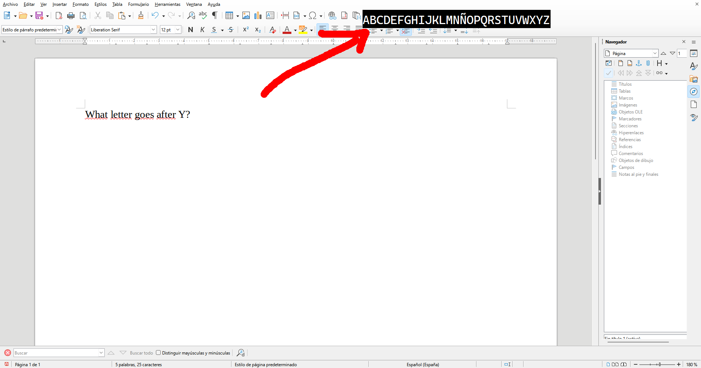
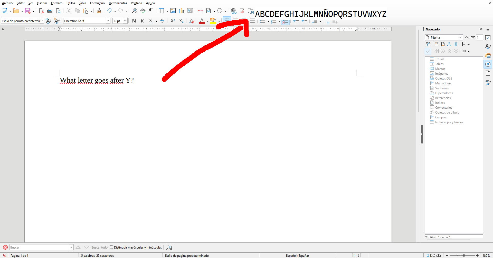

Do you often have to say "abcdefghijklmnopqrstuvwxyz" in your head to remember the order? Fear no more, the answer is here.

# How it looks
font: cascadia code.
### dark mode

### dark mode

# Configuration
All configuration can be changed in the "config.txt" file

* If your language has a different abecedary, you should change the #\[text\] field.
* You can change the font with the #\[font family\] and #\[font size\] fields
* The size of the window doesn't automatically adjust to the text, so you must manually do it too with the #\[size\] field.
* Change where the upper-left corner of the window is with the #\[initial position\] field.
* If you don't see any changes when altering config.txt, it may be because you have done it incorrectly and is using a default configuration for the field that is incorrect.

## Positioning guide
Read this if you don't want the window in your primary screen.
* Horizontal: 0, vertical: 0 is top-left corner of the main screen.
* Position is relative to the Main screen. So if I want to put it at (50, 50) of the screen to the left of my 1920x1080 main screen I should write this:        
    horizontal: -1890, vertical: 50